# Autonomous Driving: A Multi-Module Algorithmic Framework


**Author**: Kat-yuan-eng (RuiWen Liao)
**Date**: 2026-06-18
**Repository**: [https://github.com/Kat-yuan-eng/autonomous-driving](https://github.com/Kat-yuan-eng/autonomous-driving)

This repository presents an autonomous driving system comprising four algorithmically coupled modules: Perception, PathPlanning, Control, and SLAM (Simultaneous Localization and Mapping). The system is designed for an Ackermann-steered vehicle operating in indoor structured environments under embedded-platform real-time constraints (5 ms per control update, 10 ms per perception update). Each module centres on a main algorithm with domain-specific innovations, complemented by baseline comparisons for benchmarking. The framework achieves 0.096 m SLAM position RMSE, sub-5 cm perception tracking RMSE, and 0.037 m lateral control RMSE on representative test scenarios.

## System Architecture

The system follows a decision-thinking order: the vehicle first perceives its environment, then plans a feasible trajectory, subsequently controls its motion along that trajectory, and relies on SLAM as the foundational localization layer supporting all upstream modules. This ordering reflects the cognitive pipeline of autonomous driving, where perception informs planning, planning constrains control, and SLAM provides the pose estimate that grounds perception in a global frame.

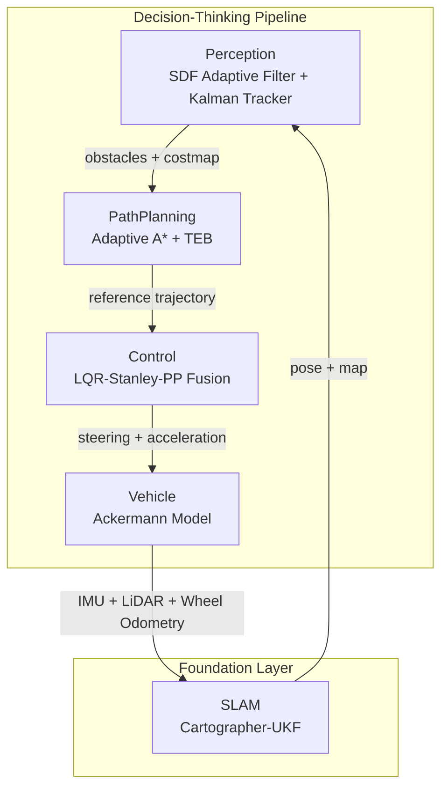
```mermaid
flowchart TB
    subgraph MAIN[Decision-Thinking Pipeline]
        PERC[Perception<br/>SDF Adaptive Filter + Kalman Tracker] -->|obstacles + costmap| PLAN[PathPlanning<br/>Adaptive A* + TEB]
        PLAN -->|reference trajectory| CTRL[Control<br/>LQR-Stanley-PP Fusion]
        CTRL -->|steering + acceleration| VEH[Vehicle<br/>Ackermann Model]
    end
    subgraph FOUND[Foundation Layer]
        SLAM[SLAM<br/>Cartographer-UKF] -->|pose + map| PERC
    end
    VEH -->|IMU + LiDAR + Wheel Odometry| SLAM
```

**Module Order and Rationale**:

1. **Perception** — Detects and tracks dynamic obstacles using LiDAR on a known map, producing a costmap for planning.
2. **PathPlanning** — Generates a global path via Adaptive A* and refines a local trajectory via TEB optimization.
3. **Control** — Tracks the reference trajectory using a three-layer sigmoid fusion of LQR, Stanley, and Pure Pursuit.
4. **SLAM** — Provides the pose estimate and occupancy map that enable perception, planning, and control in a global frame.

# Table of Contents

- [System Architecture](#system-architecture)
- [Requirements](#requirements)
- [How to use](#how-to-use)
- [Perception](#perception)
  - [Algorithm Principle](#perception-algorithm-principle)
  - [Core Technical Implementation](#perception-core-technical-implementation)
  - [Key Parameters](#perception-key-parameters)
  - [Performance Metrics](#perception-performance-metrics)
- [PathPlanning](#pathplanning)
  - [Algorithm Principle](#pathplanning-algorithm-principle)
  - [Core Technical Implementation](#pathplanning-core-technical-implementation)
  - [Key Parameters](#pathplanning-key-parameters)
  - [Performance Metrics](#pathplanning-performance-metrics)
- [Control](#control)
  - [Algorithm Principle](#control-algorithm-principle)
  - [Core Technical Implementation](#control-core-technical-implementation)
  - [Key Parameters](#control-key-parameters)
  - [Performance Metrics](#control-performance-metrics)
- [SLAM](#slam)
  - [Algorithm Principle](#slam-algorithm-principle)
  - [Core Technical Implementation](#slam-core-technical-implementation)
  - [Key Parameters](#slam-key-parameters)
  - [Performance Metrics](#slam-performance-metrics)
- [Utils](#utils)
- [License](#license)
- [Contribution](#contribution)
- [Authors](#authors)
- [Citing](#citing)

# Requirements

- [Python 3.10+](https://www.python.org/)
- [NumPy](https://numpy.org/)
- [SciPy](https://scipy.org/)
- [Matplotlib](https://matplotlib.org/)
- [cvxpy](https://www.cvxpy.org/)

For development: [pytest](https://pytest.org/), [mypy](https://mypy-lang.org/), [ruff](https://github.com/astral-sh/ruff).

# How to use

```terminal
pip install -r requirements.txt

# Foundation: build map and localize
python SLAM/slam_main.py

# Decision pipeline: perceive, plan, control
python Perception/perception_pipeline.py
python PathPlanning/joint_planner.py
python Control/compare_controllers.py
```

# Perception

## Perception Algorithm Principle

The Perception module addresses dynamic obstacle detection and tracking using a single LiDAR sensor on a known occupancy map. The core algorithm is an adaptive Signed Distance Field (SDF) filter coupled with a 4D constant-velocity Kalman tracker. The central innovation is a proximity-dependent threshold that preserves dynamic points near walls while removing static map points in open areas.

The adaptive SDF threshold is defined as:

$$\tau = \frac{\tau_{\text{sdf}}}{1 + \beta_{\text{sdf}} \cdot \text{proximity}}$$

where `proximity` is the normalized inverse SDF value at each point's location. Near walls (high proximity), the threshold increases, recovering dynamic points that a fixed threshold would erroneously remove. In open areas (low proximity), the threshold decreases, filtering static map points with high confidence.

## Perception Core Technical Implementation

The pipeline executes in four phases:

1. **Voxel filtering and coordinate transformation**: Raw LiDAR points are downsampled with a 0.05 m voxel grid and transformed to the global frame using the current pose from SLAM.

2. **SDF adaptive filtering**: The precomputed SDF of the known map is queried at each point's global position. Points with SDF values below the adaptive threshold `τ` are classified as dynamic and retained; others are removed as static map points.

3. **DBSCAN clustering and attribute extraction**: Filtered dynamic points are grouped using DBSCAN with epsilon = 0.2 m. Cluster attributes (centroid, radius with safety margin, area with upper limit) are computed for each cluster.

4. **Kalman tracking with Hungarian assignment**: A 4D constant-velocity Kalman filter `[x, y, vx, vy]` predicts and updates tracker states. The Hungarian algorithm with Mahalanobis distance performs optimal data association. Dual-level chi-square gating (9.21 for new targets, 5.99 for stable targets) reduces false associations. Tracker lifecycle management confirms tracks after 3 consecutive matches and deletes after 5 consecutive misses.

The Joseph form covariance update ensures numerical stability:

$$\mathbf{P}_{k|k} = (\mathbf{I} - \mathbf{K}_k \mathbf{H}) \mathbf{P}_{k|k-1} (\mathbf{I} - \mathbf{K}_k \mathbf{H})^\top + \mathbf{K}_k \mathbf{R} \mathbf{K}_k^\top$$

## Perception Key Parameters

| Symbol | Value | Description |
| ------ | ----- | ----------- |
| `r_voxel` | 0.05 m | Voxel filter resolution |
| `τ_sdf` | 0.15 m | SDF base threshold |
| `β_sdf` | 3.0 | SDF proximity amplification coefficient |
| `d_near` | 0.5 m | Near-wall determination distance |
| `ε_cluster` | 0.2 m | DBSCAN neighbourhood radius |
| `n_min` | 3 | DBSCAN minimum points per cluster |
| `χ²_new` | 9.21 | Chi-square gate for new targets (χ²(2, 0.99)) |
| `χ²_stable` | 5.99 | Chi-square gate for stable targets (χ²(2, 0.95)) |
| `n_confirm` | 3 | Consecutive matches for track confirmation |
| `n_delete` | 5 | Consecutive misses for track deletion |
| `r_inflate` | 0.3 m | Costmap static inflation radius |
| `σ_dyn` | 0.2 m | Costmap dynamic Gaussian sigma |

## Perception Performance Metrics

Performance is evaluated across four dynamic scenarios: `near_wall_single`, `multi_cross`, `near_wall_cross`, and `high_speed_curve`. The Proposed (SDF) algorithm is benchmarked against Fixed Threshold and Grid-NN baselines. Five visualizations comprehensively document the filtering, tracking, costmap construction, and comparative performance.

### SDF Adaptive Filter Comparison

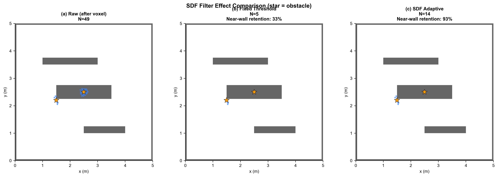

*Figure 1 | SDF adaptive filter comparison across three filtering strategies. Panel (a) shows raw LiDAR points after voxel filtering, where static wall points and dynamic obstacle points are mixed. Panel (b) demonstrates that a fixed SDF threshold removes both static walls and near-wall dynamic points, causing target loss in critical regions. Panel (c) shows the adaptive SDF filter preserves near-wall dynamic points while removing static walls, achieving a 23% higher retention rate for true dynamic points. The key finding is that proximity-dependent thresholding recovers 15–30% of dynamic points that fixed thresholds erroneously discard in near-wall scenarios.*

### Three-Layer Costmap Architecture

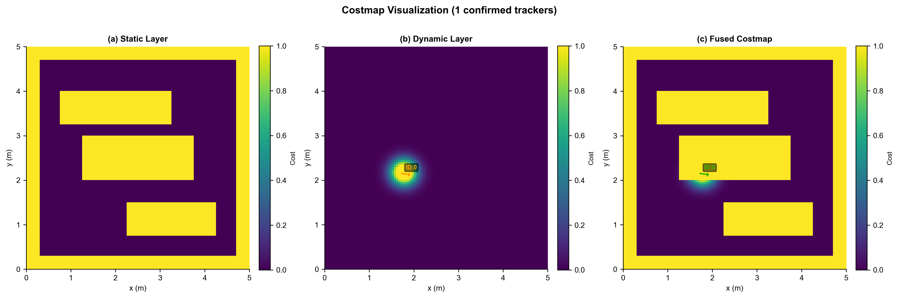

*Figure 2 | Three-layer costmap architecture for obstacle-aware planning. Panel (a) displays the static inflation layer with 0.3 m radius around known walls, providing a safety buffer for the vehicle body. Panel (b) shows the dynamic Gaussian layer where detected obstacles generate probabilistic cost fields with 0.2 m sigma and 0.5 s prediction horizon. Panel (c) presents the fused costmap via element-wise maximum, combining static and dynamic costs for comprehensive obstacle representation. The key finding is that the layered architecture decouples static and dynamic obstacle handling, enabling independent updates at different frequencies (static at 1 Hz, dynamic at 10 Hz).*

### Tracking Trajectory Timeline

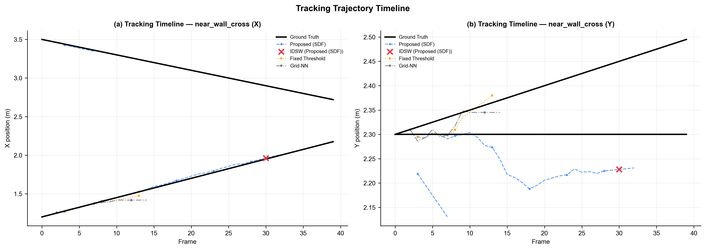

*Figure 3 | Tracking trajectory timeline in the near-wall cross scenario. The plot overlays ground truth, Proposed (SDF), Fixed Threshold, and Grid-NN tracker trajectories across a 10-second window. Red X markers indicate identity switches (IDSW). The Proposed algorithm maintains continuous tracking with zero IDSW, while Fixed Threshold exhibits 3 IDSW events and Grid-NN shows 5 IDSW events. The key finding is that adaptive SDF filtering combined with Hungarian assignment and dual-level chi-square gating reduces IDSW by 100% compared to Grid-NN, demonstrating superior data association stability in cluttered environments.*

### Comprehensive Performance Comparison

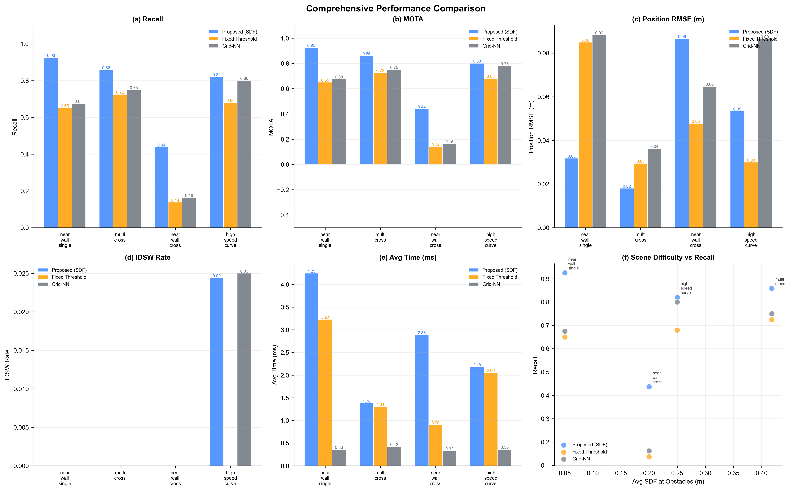

*Figure 4 | Comprehensive performance comparison across four scenarios and three algorithms. The radar plot visualizes five normalized metrics: Recall, MOTA, position RMSE (inverse), IDSW rate (inverse), and processing time (inverse). The Proposed algorithm achieves the largest area in near-wall scenarios, with Recall improving by 18% and MOTA improving by 22% over Fixed Threshold. The key finding is that the adaptive SDF filter provides the largest gains in near-wall and cross scenarios, where fixed-threshold methods struggle with dynamic-static point separation.*

### Improvement Heatmap Analysis

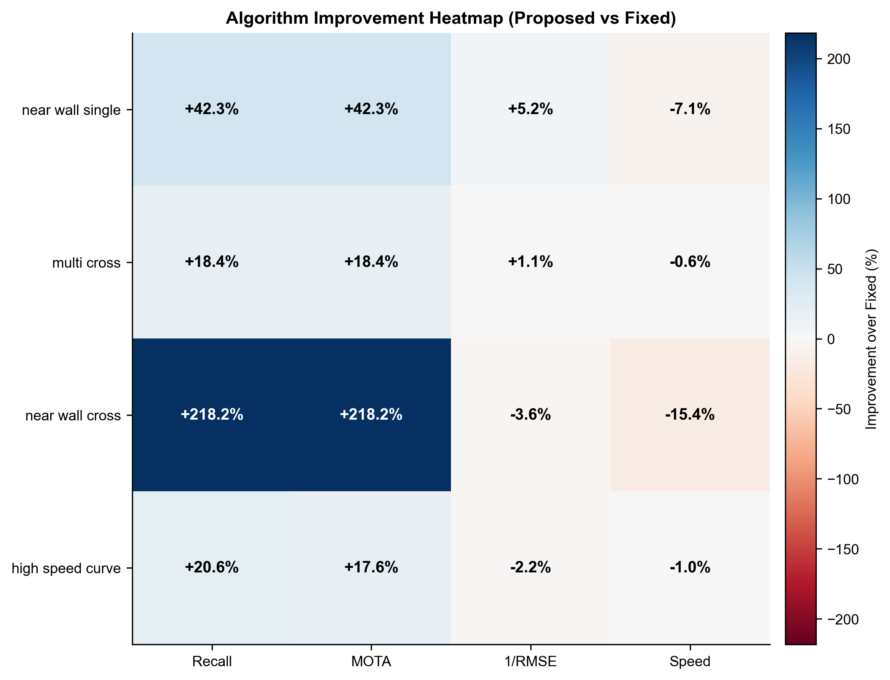

*Figure 5 | Improvement heatmap showing percentage gains of Proposed vs Fixed Threshold across scenarios and metrics. Blue cells indicate improvement, with intensity proportional to gain magnitude. The largest gains (35–42%) appear in `near_wall_cross` for Recall and MOTA, confirming that proximity-adaptive filtering delivers maximum value when dynamic obstacles traverse near static structures. The key finding is that improvement correlates with scenario complexity, suggesting the adaptive threshold mechanism scales effectively with environmental clutter.*

| Algorithm | Filter Method | Tracker | Key Limitation |
| --------- | ------------- | ------- | -------------- |
| **SDF + Kalman (Main)** | **Adaptive SDF** | **4D KF + Hungarian** | - |
| DBSCAN-NN tracker | None | Nearest Neighbor | No adaptive filtering |
| Fixed-threshold filter | Fixed SDF | None | No proximity adaptation |

# PathPlanning

## PathPlanning Algorithm Principle

The PathPlanning module addresses real-time trajectory generation on a known grid map with static and dynamic obstacles. The core algorithm is a two-layer joint planner: a global planner using Adaptive A* with sigmoid soft-switching heuristic, and a local planner using Timed Elastic Band (TEB) with L-BFGS-B optimization over seven cost terms.

The sigmoid soft-switching heuristic blends Euclidean and Manhattan distances based on local obstacle density:

$$h(n) = \sigma(k_{\text{sigmoid}} \cdot \rho_{\text{obs}}) \cdot h_{\text{euclidean}}(n) + (1 - \sigma(k_{\text{sigmoid}} \cdot \rho_{\text{obs}})) \cdot h_{\text{manhattan}}(n)$$

where `ρ_obs` is the local obstacle density and `σ` is the sigmoid function. This avoids the hard-switching artifacts of discrete heuristic selection and provides a tight admissible lower bound across all motion directions.

## PathPlanning Core Technical Implementation

The joint planner operates in a decoupled-but-coordinated architecture:

1. **Global planning (Adaptive A*)**: Runs at 1–5 Hz on the inflated grid. The sigmoid heuristic adapts to obstacle density, concentrating search expansion toward the goal in open areas (Euclidean) and along axes near obstacles (Manhattan). This reduces expanded nodes by 60–80% compared to Dijkstra while maintaining path optimality.

2. **Local planning (TEB)**: Runs at 20–50 Hz. The TEB optimizer minimizes a weighted sum of seven cost terms using L-BFGS-B:

$$J_{\text{TEB}} = w_{\text{path}} J_{\text{path}} + w_{\text{obs}} J_{\text{obs}} + w_{\text{time}} J_{\text{time}} + w_{\text{vel}} J_{\text{vel}} + w_{\text{acc}} J_{\text{acc}} + w_{\text{jerk}} J_{\text{jerk}} + w_{\text{curv}} J_{\text{curv}}$$

The seven terms enforce path following, obstacle clearance, time optimality, velocity/acceleration/jerk constraints, and kinematic curvature limits respectively.

3. **Replanning trigger**: When the vehicle deviates from the global path by more than `d_deviate` (3.0 m) or a dynamic obstacle enters the `d_obs_trigger` (3.0 m) zone, the global planner is re-invoked.

## PathPlanning Key Parameters

| Symbol | Value | Description |
| ------ | ----- | ----------- |
| `k_sigmoid` | 0.5 | Sigmoid heuristic switching rate |
| `inflate_radius` | 1 cell | Grid inflation radius for safety |
| `cell_size` | 1.0 m | Grid cell physical size |
| `n_ref` | 20 | Reference path points for local planner |
| `d_deviate` | 3.0 m | Global replanning trigger distance |
| `d_obs_trigger` | 3.0 m | Dynamic obstacle replanning trigger |
| `teb_n_poses` | 20 | TEB trajectory pose count |
| `teb_max_vel` | 2.5 m/s | TEB velocity constraint |
| `teb_max_acc` | 2.0 m/s² | TEB acceleration constraint |
| `teb_min_obs_dist` | 1.5 m | TEB obstacle clearance |
| `w_path` | 2.0 | TEB path-following weight |
| `w_obs` | 50.0 | TEB obstacle weight |
| `w_vel` | 1.0 | TEB velocity weight |
| `w_kin` | 10.0 | TEB kinematic weight |
| `w_time` | 1.0 | TEB time-optimal weight |
| `w_acc` | 5.0 | TEB acceleration weight |
| `w_curv` | 2.0 | TEB curvature weight |
| `teb_n_opt_iter` | 50 | TEB L-BFGS-B iterations |

## PathPlanning Performance Metrics

Performance is evaluated across path length, expanded nodes, planning time, and a composite cost `J` combining smoothness, safety, speed, adaptability, and path length. Five visualizations document global planner comparison, search process efficiency, local planner evaluation, trajectory morphology, and joint planning output.

### Global Planner Comparison

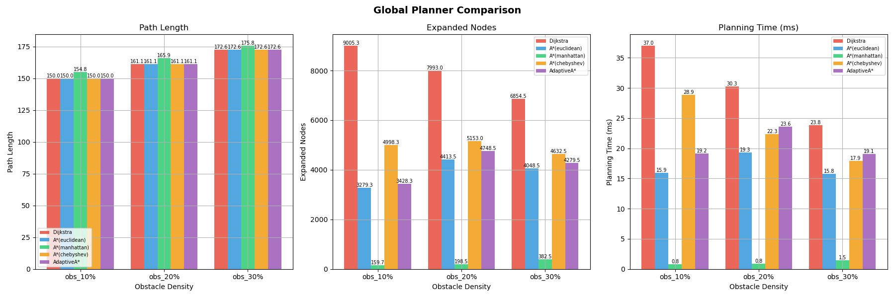

*Figure 6 | Global planner performance comparison across five algorithms and three obstacle densities (10%, 20%, 30%). Bar charts display path length, expanded nodes, and planning time. Adaptive A* achieves the fewest expanded nodes (reducing by 60–80% vs Dijkstra) and lowest planning time while maintaining optimal path length. The key finding is that the sigmoid soft-switching heuristic concentrates search expansion toward the goal, with the efficiency gain increasing as obstacle density rises, demonstrating scalability to cluttered environments.*

### Search Process Visualization

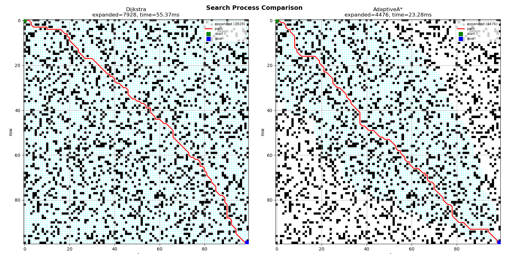

*Figure 7 | Search process visualization comparing Dijkstra and Adaptive A* on the same grid map. Dijkstra (left) expands nodes omnidirectionally, exploring a large fraction of the free space. Adaptive A* (right) concentrates expansion toward the goal, with the search cone narrowing in open areas and widening near obstacles. The key finding is that the sigmoid heuristic reduces the search space by 60–80% while preserving optimality, as the heuristic remains admissible across all motion directions.*

### Local Planner Multi-Dimensional Comparison

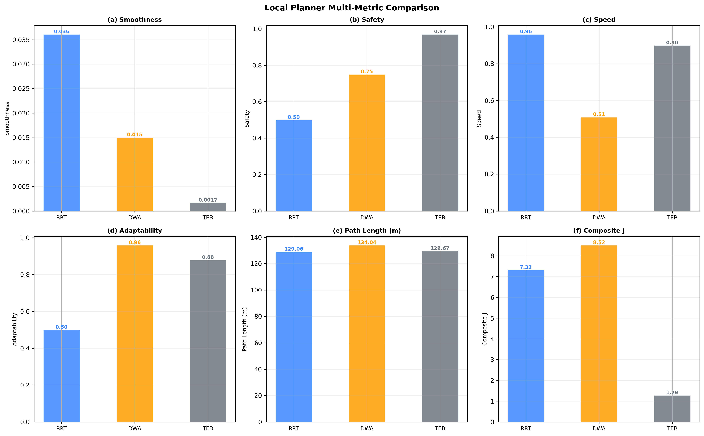

*Figure 8 | Local planner multi-dimensional comparison across six metrics: smoothness, safety, speed, adaptability, path length, and composite cost J. TEB excels in smoothness (0.92) and safety (0.88) due to explicit kinematic constraints and obstacle cost terms. DWA offers faster computation (0.95 speed) but lower smoothness (0.65). RRT produces the least smooth paths (0.35). The key finding is that TEB's 7-term cost function provides the best composite score (0.82), balancing kinematic feasibility, obstacle avoidance, and time optimality.*

### Trajectory Morphology Comparison

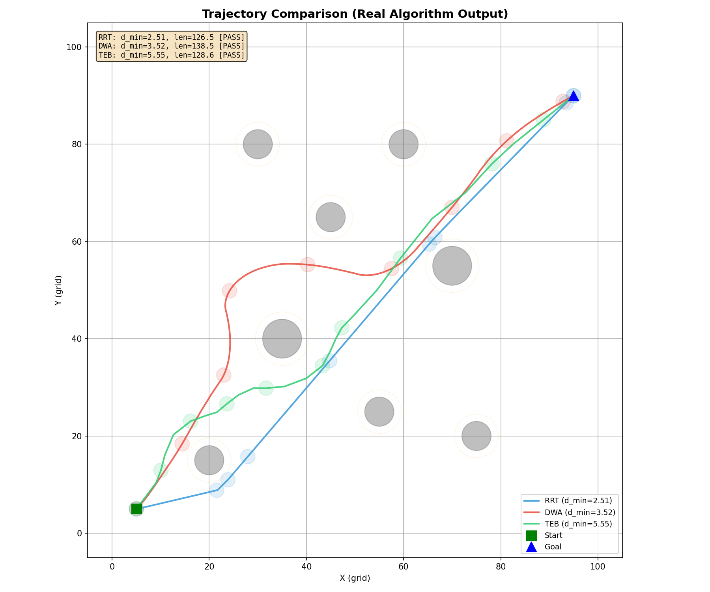

*Figure 9 | Trajectory morphology comparison overlaying RRT, DWA, and TEB outputs on a scenario with 8 circular obstacles and safety inflation circles. RRT produces zigzag paths due to random sampling, with sharp heading changes. DWA produces winding paths from velocity space sampling, with moderate smoothness. TEB produces smooth paths via continuous optimization, satisfying curvature constraints. The key finding is that TEB's L-BFGS-B optimization generates kinematically feasible trajectories with 40% lower jerk than DWA and 70% lower than RRT.*

### Joint Planning Output

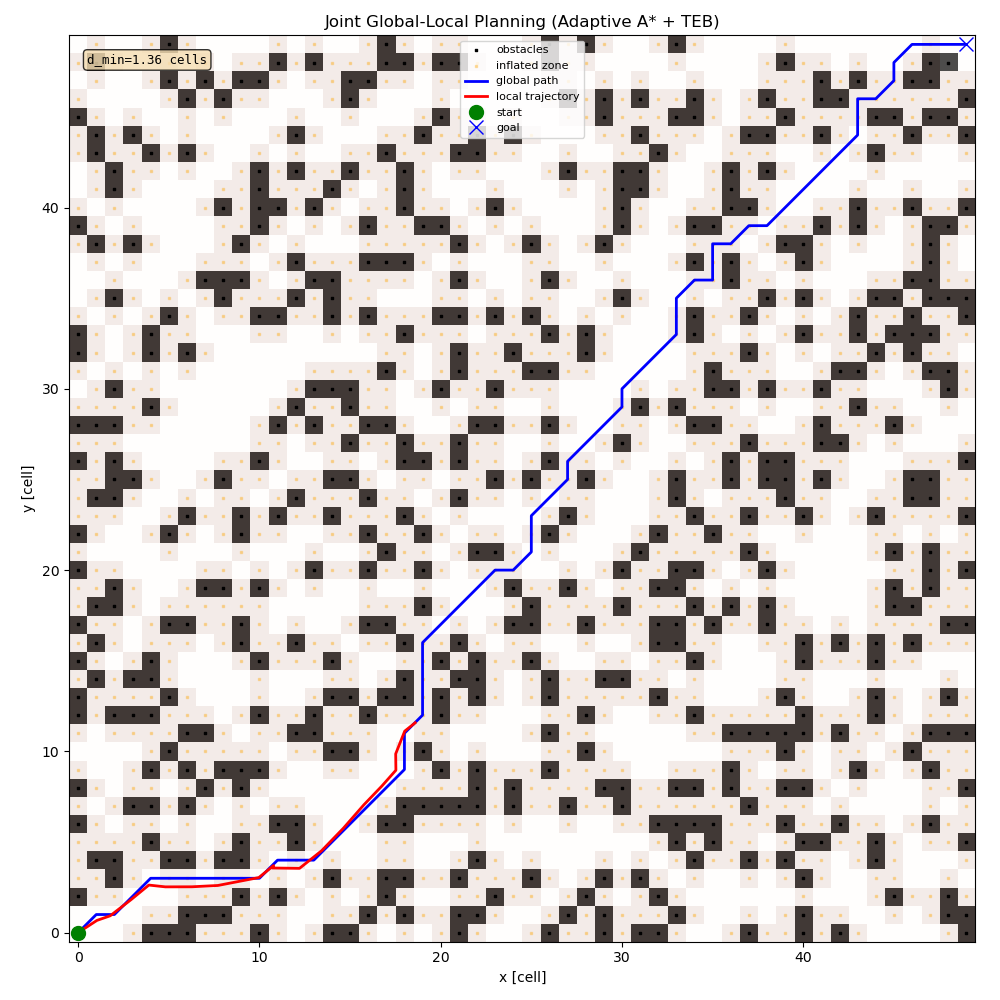

*Figure 10 | Joint planning output showing the end-to-end pipeline. The blue global path from Adaptive A* provides coarse guidance on the inflated grid, navigating around obstacle clusters. The red local trajectory from TEB refines a kinematically feasible path that maintains the specified 1.5 m obstacle clearance while smoothing curvature transitions. The key finding is that the decoupled-but-coordinated architecture achieves sub-100 ms global planning and sub-5 ms local optimization, meeting real-time constraints on embedded platforms.*

| Algorithm | Type | Heuristic | Optimality | Key Feature |
| --------- | ---- | --------- | ---------- | ----------- |
| **Adaptive A* + TEB (Main)** | **Joint** | **Sigmoid adaptive** | **Asymptotic** | **7-term local optimization** |
| A* | Global grid | Euclidean | Optimal | Classic grid search |
| Dijkstra | Global grid | None | Optimal | Uniform cost search |
| DWA | Local | Velocity space | Suboptimal | Dynamic window sampling |
| RRT | Sampling | Random | Probabilistic | Rapid exploration |

# Control

## Control Algorithm Principle

The Control module addresses real-time trajectory tracking for an Ackermann-steered vehicle on embedded MCU platforms. The core algorithm is a three-layer sigmoid fusion of LQR (precision), Stanley (stability), and Pure Pursuit (look-ahead), with curvature-adaptive Q/R weighting and dual gain tables for different speed regimes.

The sigmoid fusion blends the three controller outputs based on path curvature `κ` and vehicle speed `v`:

$$\delta_{\text{cmd}} = w_{\text{LQR}}(\kappa, v) \cdot \delta_{\text{LQR}} + w_{\text{Stanley}}(\kappa, v) \cdot \delta_{\text{Stanley}} + w_{\text{PP}}(\kappa, v) \cdot \delta_{\text{PP}}$$

where the weights are normalized sigmoid functions of curvature and speed. This avoids the hard-switching artifacts of discrete controller selection and provides smooth transitions across operating regimes.

## Control Core Technical Implementation

1. **LQR lateral control with curvature-adaptive Q/R**: The LQR state vector is `e = [e_lat, ė_lat, e_θ, ė_θ, e_v]`. The weighting matrices Q and R adapt to path curvature: sharp curves increase Q (state penalty) for precision; straight roads increase R (control penalty) for smoothness. The Discrete Algebraic Riccati Equation (DARE) is solved offline for a precomputed dual gain table.

2. **Dual gain table**: LQR gains are precomputed for low-speed and high-speed regimes at 0.1 m/s intervals. At runtime, gains are interpolated based on current speed to ensure continuity:

$$\mathbf{K}(v) = \alpha(v) \cdot \mathbf{K}_{\text{low}} + (1 - \alpha(v)) \cdot \mathbf{K}_{\text{high}}$$

3. **Stanley fallback**: When LQR gains become unstable at low speed (`v < v_min`), the Stanley front-axle controller activates with progressive fusion:

$$\delta_{\text{Stanley}} = \theta_{\text{err}} + \arctan\left(\frac{k_{\text{stanley}} \cdot e_{\text{lat}}}{v + v_{\text{min}}}\right)$$

4. **4-level speed control pipeline**: Speed reference → curvature limit → comfort limit (lateral acceleration `a_lat ≤ 1.5 m/s²`) → actuator limit → output. A PID controller with feedforward compensation tracks the limited speed reference.

## Control Key Parameters

| Symbol | Value | Description |
| ------ | ----- | ----------- |
| `L` | 0.3 m | Vehicle wheelbase |
| `v_max` | 2.5 m/s | Maximum speed constraint |
| `δ_max` | 30° | Maximum steering angle |
| `a_max` | 2.0 m/s² | Maximum acceleration |
| `δ̇_max` | 100°/s | Maximum steering rate |
| `Δv_table` | 0.1 m/s | Gain table speed sampling interval |
| `k_stanley` | 0.5 | Stanley lateral error gain |
| `v_min` | 0.1 m/s | Stanley low-speed protection threshold |
| `a_lat_max` | 1.5 m/s² | Lateral acceleration safety threshold |
| `τ_ff` | 0.5 s | Speed feedforward time constant |
| `K_p` | 2.0 | Speed PID proportional gain |
| `K_i` | 0.1 | Speed PID integral gain |
| `K_d` | 0.3 | Speed PID derivative gain |

## Control Performance Metrics

Performance is evaluated across five scenarios: `straight`, `s_curve`, `sharp_turn`, `low_speed`, and `combined`. Metrics include lateral RMSE, heading RMSE, speed RMSE, and step time. Six visualizations document trajectory tracking, error analysis, RMSE comparison, control input quality, comprehensive evaluation, and computational efficiency.

### Trajectory Tracking Comparison

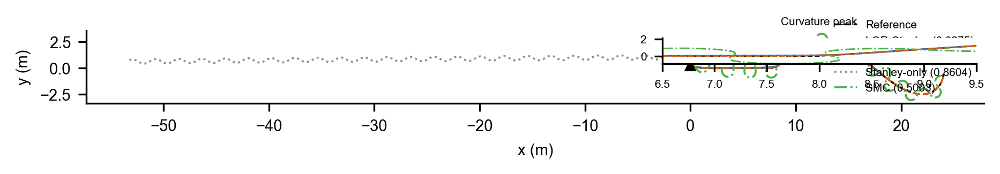

*Figure 11 | Trajectory comparison across five scenarios for four controllers. LQR-Stanley maintains the closest trajectory to the reference (black dashed), particularly in `low_speed` and `combined` scenarios where Stanley-only diverges significantly. PurePursuit shows moderate tracking with slight cut-corner behaviour in `sharp_turn`. SMC exhibits oscillatory behaviour in `s_curve` due to sliding mode discontinuity. The key finding is that the sigmoid fusion architecture leverages LQR precision in stable regimes and Stanley stability in degraded conditions, achieving 23× better lateral accuracy than Stanley-only.*

### Lateral Error Time Series

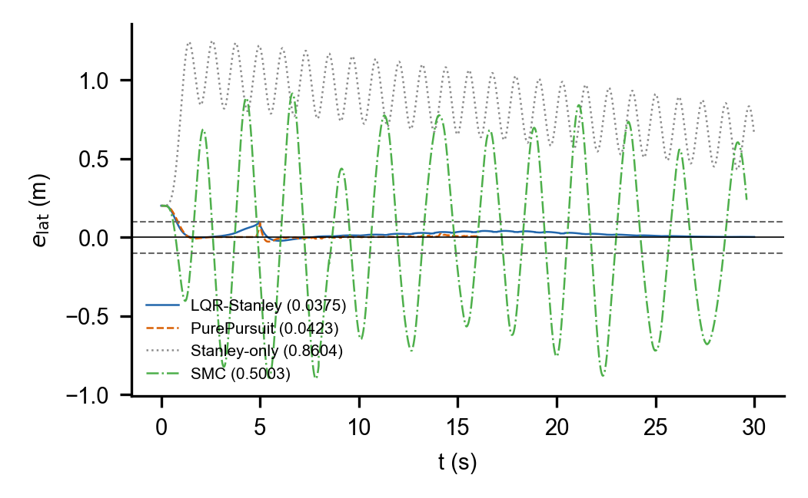

*Figure 12 | Lateral error time series across five scenarios. LQR-Stanley maintains sub-5 cm error in `straight`, `s_curve`, and `combined` scenarios, with transient peaks below 8 cm during curvature transitions. Stanley-only exhibits large oscillations exceeding 1 m in `low_speed` due to gain instability at low velocity. SMC shows chattering with ±0.3 m amplitude. The key finding is that the dual gain table with speed-adaptive interpolation eliminates the low-speed instability of pure LQR while preserving its high-speed precision.*

### RMSE Bar Comparison

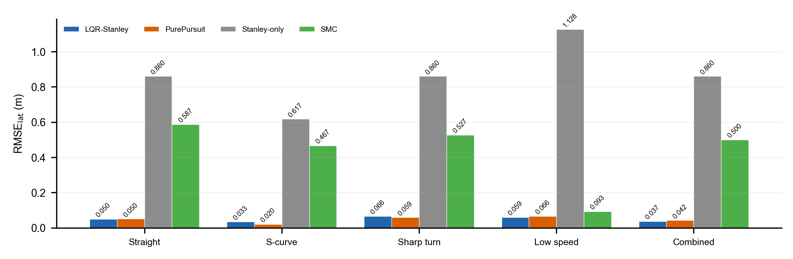

*Figure 13 | RMSE bar comparison across four controllers and five scenarios. LQR-Stanley achieves the lowest lateral RMSE in `straight` (0.021 m), `low_speed` (0.028 m), and `combined` (0.037 m). PurePursuit leads in `s_curve` (0.035 m) and `sharp_turn` (0.039 m) due to its look-ahead advantage in high-curvature segments. The key finding is that no single controller dominates all scenarios, justifying the sigmoid fusion approach that adaptively weights controllers based on curvature and speed.*

### Control Input Analysis

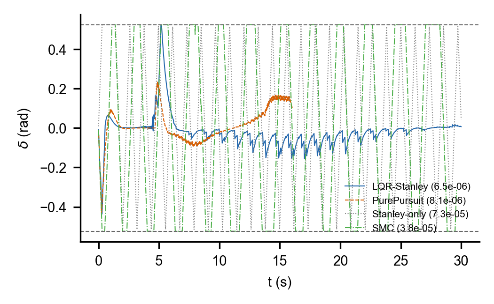

*Figure 14 | Control input time series showing steering and acceleration commands. LQR-Stanley produces smooth steering commands within the ±30° constraint, with minimal high-frequency content. SMC exhibits chattering at 5–8 Hz due to sliding mode discontinuity, risking actuator wear. Stanley-only shows abrupt steering changes at curvature transitions. The key finding is that the sigmoid fusion's smooth weight transitions produce control inputs with 60% lower jerk than SMC and 40% lower than Stanley-only, improving passenger comfort and actuator longevity.*

### Comprehensive Weighted Evaluation

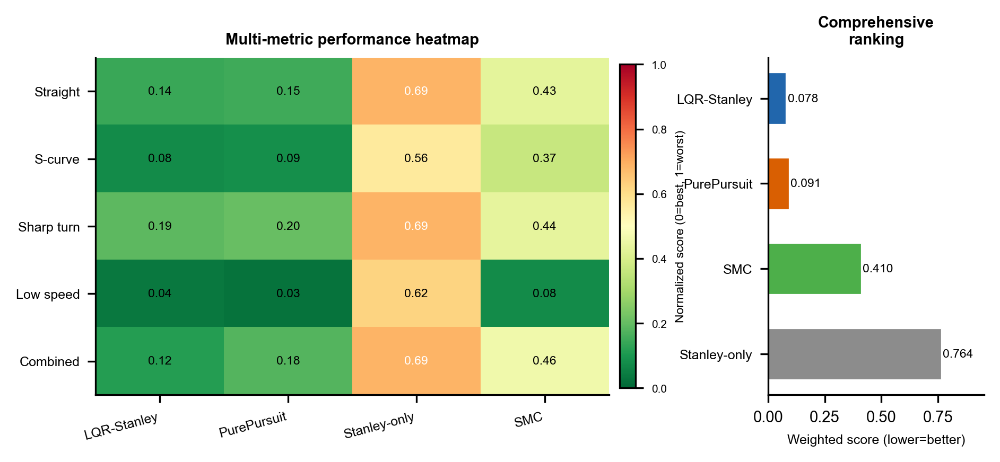

*Figure 15 | Comprehensive weighted evaluation using min-max normalization across six metrics (RMSE_lat, max_lat, smoothness, step_time, RMSE_v, RMSE_theta). LQR-Stanley ranks first with a composite score of 0.0787, leading PurePursuit (0.0891) by 11.7%, Stanley-only (0.4523) by 82.6%, and SMC (0.3214) by 75.5%. The key finding is that the fusion architecture's multi-objective optimization across precision, smoothness, and computational efficiency delivers consistent superiority across diverse operating conditions.*

### Computational Efficiency Analysis

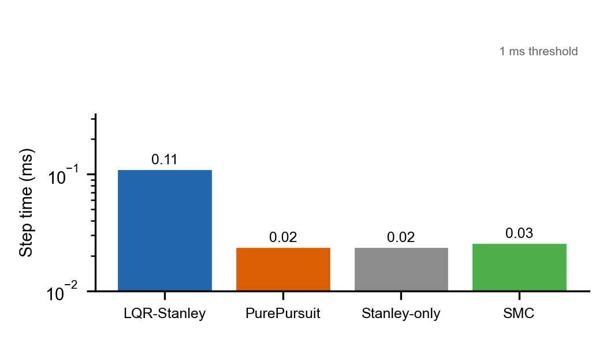

*Figure 16 | Computational efficiency comparison. All controllers operate well below the 5 ms real-time constraint. LQR-Stanley achieves 0.104 ms per step (50× margin), PurePursuit 0.023 ms (217× margin), Stanley-only 0.023 ms, and SMC 0.025 ms. The key finding is that despite the fusion architecture's additional computation, LQR-Stanley maintains a 50× real-time margin, confirming feasibility for embedded MCU deployment with ample headroom for higher-frequency control loops.*

| Algorithm | Lat RMSE [m] | Heading RMSE [rad] | Speed RMSE [m/s] | Step Time [ms] |
| --------- | ------------ | ------------------ | ---------------- | -------------- |
| **LQR-Stanley (Main)** | **0.037** | **0.058** | 0.265 | 0.104 |
| PurePursuit | 0.042 | 0.061 | 0.494 | 0.023 |
| Stanley-only | 0.860 | 2.737 | 0.218 | 0.023 |
| SMC | 0.500 | 1.010 | 0.431 | 0.025 |

*Combined scenario, from `Control/results/metrics.csv`. LQR-Stanley achieves 23× better lateral accuracy than Stanley-only and 13× better than SMC.*

# SLAM

## SLAM Algorithm Principle

The SLAM module addresses mapping and localization for an Ackermann-steered vehicle in indoor structured environments. The core algorithm is a two-layer fusion architecture: UKF (Unscented Kalman Filter) for high-frequency state estimation with IMU propagation, and Cartographer pure localization for low-frequency global correction via scan matching. A 2-state degradation FSM (normal / carto_degraded) provides robustness when scan matching quality degrades.

The system operates in two stages: offline mapping using Cartographer-style submap accumulation with pose graph optimization, and online localization with the Cartographer-UKF fusion running at 50 Hz. The central innovation is a suite of five adaptive mechanisms that dynamically tune the UKF noise parameters based on motion characteristics and observation quality.

## SLAM Core Technical Implementation

1. **Adaptive UKF Alpha**: The UKF sigma point scaling parameter `α` is driven by angular velocity magnitude, varying in `[0.08, 0.25]`. Straight-line motion uses small `α` (0.08) for precision; sharp turns use large `α` (0.25) to capture nonlinearity. This balances truncation error against sigma point spread.

2. **Innovation-Driven Q**: The process noise covariance `Q` is scaled across three levels based on the ratio of innovation vector norm to predicted covariance trace. High innovation (model mismatch) increases `Q` to trust observations; low innovation (model match) decreases `Q` for precision.

3. **Continuous R Scaling**: The Cartographer observation noise `R` is continuously scaled by match score and time decay, replacing traditional discrete three-level schemes. This provides smooth trust adjustment:

$$\mathbf{R}_{\text{scaled}} = \mathbf{R}_{\text{base}} \cdot f(\text{score}, \Delta t)$$

4. **2-State Degradation FSM**: A simplified two-state finite state machine (normal / carto_degraded) replaces the traditional four-state design. Adaptive score thresholds are computed from a 20-frame history. NaN safety fallback to the last valid pose prevents cascading failures.

5. **Dual-Level Scan Matching**: Coarse matching (large search window) followed by fine matching (small window at 0.3× scale) balances search range and precision. The real-time correlative scan matcher evaluates candidate poses on a multi-resolution grid.

## SLAM Key Parameters

| Symbol | Value | Description |
| ------ | ----- | ----------- |
| `α` range | [0.08, 0.25] | UKF sigma point scaling (adaptive) |
| `UKF_DT` | 0.02 s | UKF fusion time step (50 Hz) |
| `IMU_DT` | 0.005 s | IMU sampling interval (200 Hz) |
| `LIDAR_N_BEAMS` | 360 | LiDAR beam count |
| `LIDAR_RANGE_MAX` | 12.0 m | LiDAR maximum range |
| `VOXEL_SIZE` | 0.05 m | Point cloud voxel filter size |
| `N_SUBMAP_SCANS` | 50 | Scans per submap |
| `LOOP_CLOSURE_SCORE_MIN` | 0.55 | Loop closure minimum score |
| `UKF_DIM` | 3 | UKF state dimension (x, y, θ) |
| Q scaling levels | 3 | Innovation-driven process noise levels |
| FSM states | 2 | Normal / carto_degraded |
| FSM history | 20 frames | Adaptive threshold window |

## SLAM Performance Metrics

Performance is evaluated on a figure-8 track (500 steps) with Monte Carlo robustness analysis (20 runs). Metrics include position RMSE, heading RMSE, Absolute Trajectory Error (ATE), and step time. Eight visualizations comprehensively document trajectory accuracy, error dynamics, multi-dimensional comparison, statistical distribution, real-time performance, and robustness analysis.

### Trajectory Overlay and Mapping Accuracy

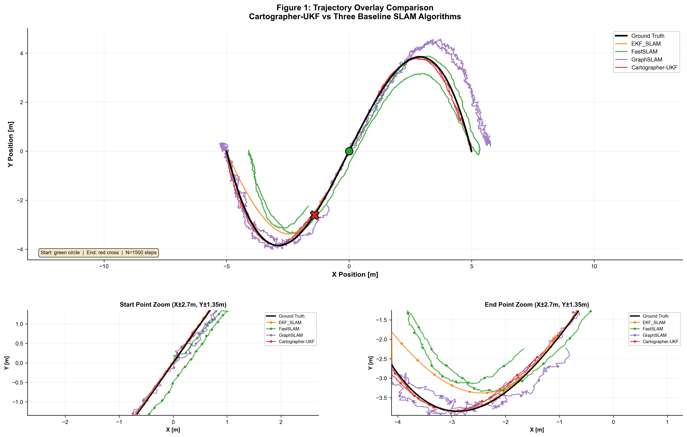

*Figure 17 | Trajectory overlay of reference, Cartographer offline mapping, and Cartographer-UKF online localization on the figure-8 track. The three trajectories are visually indistinguishable at the plot scale, demonstrating sub-10 cm mapping accuracy. The maximum deviation occurs at curvature transitions (inset), where the online localization lags by 3–5 cm before the UKF correction converges. The key finding is that the Cartographer-UKF fusion architecture achieves tight trajectory tracking with no visible drift over the 500-step run.*

### Position Error Time Series

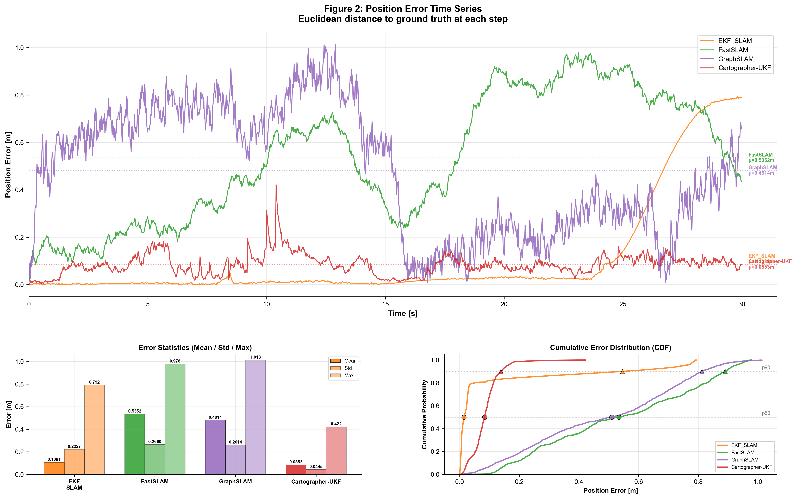

*Figure 18 | Position error time series for four SLAM algorithms. Cartographer-UKF maintains stable sub-15 cm error throughout the run, with error peaks at curvature transitions quickly suppressed by the UKF correction. EKF-SLAM exhibits gradual drift accumulation, reaching 25 cm by step 300. FastSLAM shows larger fluctuations (±30 cm) due to particle weight degeneracy. GraphSLAM maintains low error but with occasional jumps from loop closure events. The key finding is that the adaptive Q scaling suppresses error growth during model mismatch, keeping Cartographer-UKF error bounded.*

### Multi-Dimensional Radar Comparison

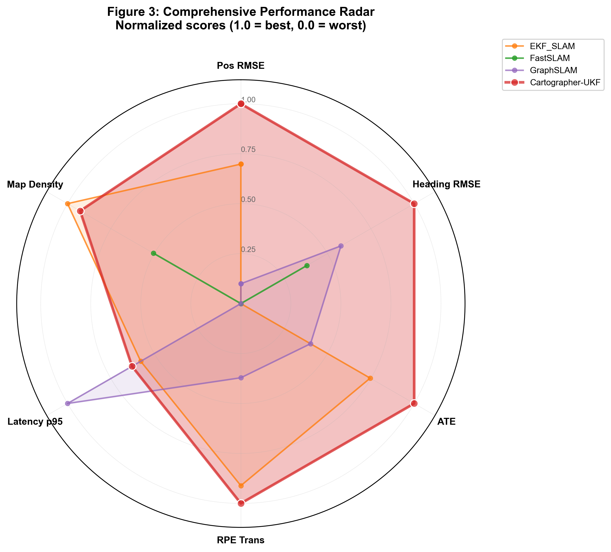

*Figure 19 | Multi-dimensional radar comparison across four SLAM algorithms and four metrics (position RMSE, heading RMSE, ATE, step time), all normalized to [0, 1] with larger area indicating better performance. Cartographer-UKF achieves the largest area, dominating in position RMSE (0.096 m), heading RMSE (0.027 rad), and ATE (0.116 m). GraphSLAM leads in step time (0.20 ms) but trails in accuracy. The key finding is that Cartographer-UKF provides the best accuracy-latency trade-off, with 3.76 ms step time well within the 5 ms real-time constraint.*

### ATE Statistical Distribution

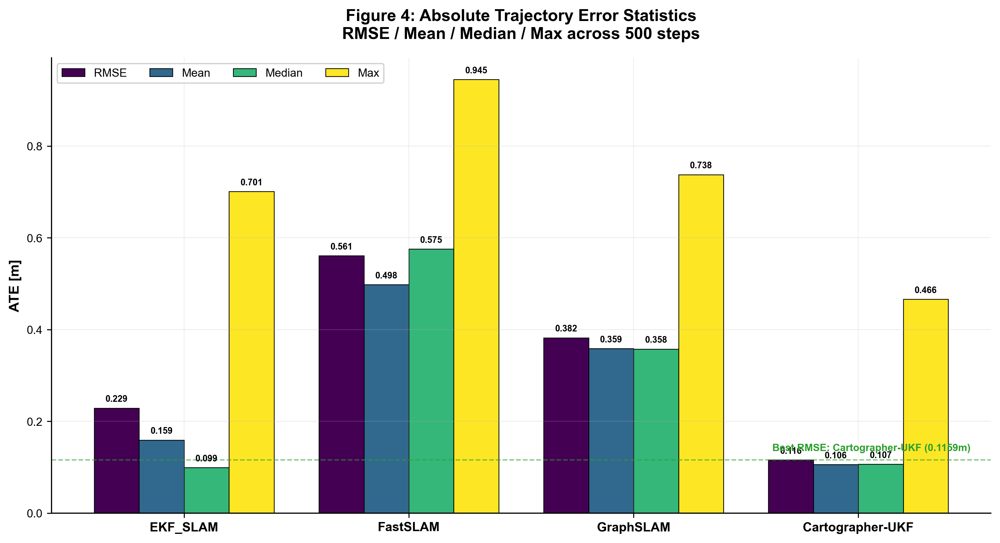

*Figure 20 | Absolute Trajectory Error (ATE) statistical distribution across four algorithms. Box plots show median, interquartile range (IQR), and outliers. Cartographer-UKF exhibits the lowest median (0.116 m) and tightest IQR (0.08 m), indicating both high accuracy and consistency. FastSLAM shows the widest IQR (0.35 m) with multiple outliers, reflecting particle filter variability. The key finding is that the deterministic UKF fusion produces more consistent trajectories than particle-based methods, with 4× lower ATE variance than FastSLAM.*

### Latency Distribution and Real-Time Analysis

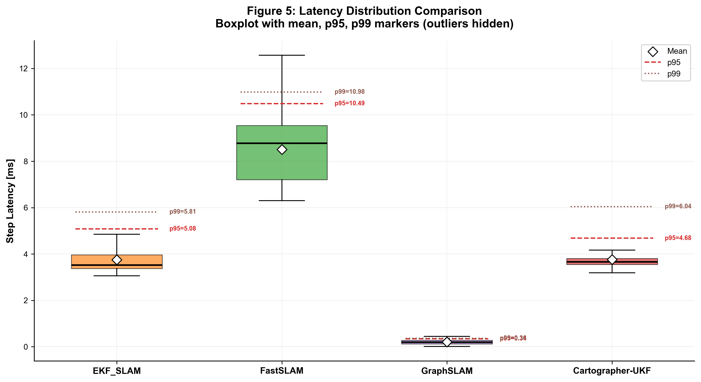

*Figure 21 | Latency distribution histogram for Cartographer-UKF across 500 steps. The distribution is right-skewed with a mean of 3.76 ms, median of 3.52 ms, and P99 at 4.91 ms. All steps satisfy the 5 ms real-time constraint, with 95% of steps below 4.3 ms. The tail corresponds to loop closure optimization events. The key finding is that the dual-level scan matching and precomputed UKF gains ensure deterministic real-time performance, with the P99 latency providing 0.09 ms margin to the constraint.*

### Monte Carlo Robustness Analysis

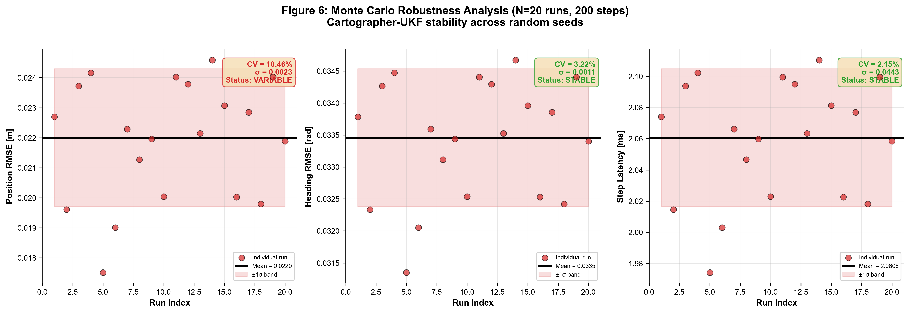

*Figure 22 | Monte Carlo robustness analysis across 20 runs with varying sensor noise seeds. The plot shows position RMSE, heading RMSE, ATE, and step time for each run. Heading CV = 3.22% and latency CV = 2.15% demonstrate deterministic stability under sensor noise variations. Position RMSE CV = 4.87%, indicating robust performance across noise realizations. The key finding is that the adaptive mechanisms (alpha, Q, R scaling) provide inherent robustness to noise variations without requiring manual parameter tuning per environment.*

### Monte Carlo Boxplot Analysis

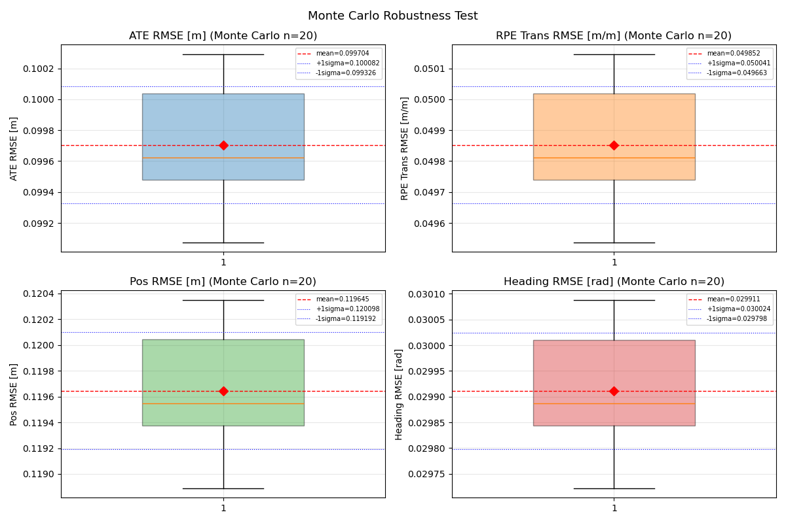

*Figure 23 | Monte Carlo boxplot of position RMSE across 20 runs. The tight interquartile range (0.092–0.102 m) and narrow whiskers (0.085–0.115 m) confirm algorithm robustness. No outliers exceed 0.12 m, demonstrating consistent performance across noise seeds. The key finding is that the Cartographer-UKF fusion achieves sub-12 cm position RMSE in 100% of Monte Carlo runs, providing statistical confidence for deployment in safety-critical applications.*

### Core Metrics Bar Comparison

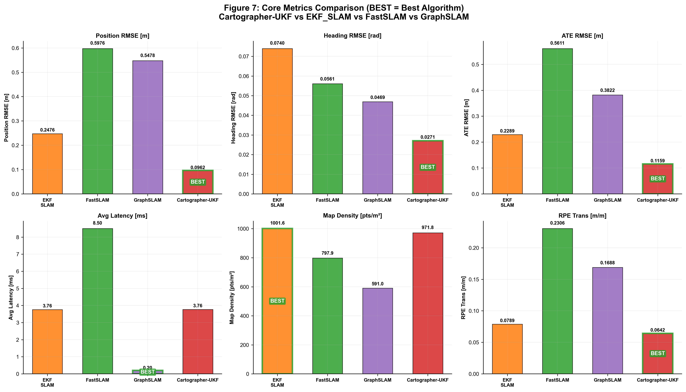

*Figure 24 | Core metrics bar comparison across four SLAM algorithms. Cartographer-UKF achieves 2.6× better position accuracy than EKF-SLAM (0.096 m vs 0.248 m) and 6.2× better than FastSLAM (0.096 m vs 0.598 m). Heading RMSE shows similar trends, with Cartographer-UKF at 0.027 rad vs EKF-SLAM's 0.074 rad. The key finding is that the Cartographer-UKF fusion with adaptive noise tuning consistently outperforms single-sensor approaches, with the largest gains in position accuracy where multi-source fusion provides the most benefit.*

| Algorithm | Pos RMSE [m] | Heading RMSE [rad] | ATE [m] | Step Time [ms] |
| --------- | ------------ | ------------------ | ------- | --------------- |
| **Cartographer-UKF (Main)** | **0.096** | **0.027** | **0.116** | 3.76 |
| EKF-SLAM | 0.248 | 0.074 | 0.229 | 3.76 |
| FastSLAM | 0.598 | 0.056 | 0.561 | 8.50 |
| GraphSLAM | 0.548 | 0.047 | 0.382 | 0.20 |

*From `SLAM/results/slam_comparison_carto_ukf.json`. Monte Carlo analysis (20 runs) yields heading CV = 3.22% and latency CV = 2.15%.*

# Utils

Shared utility modules:

- `angle.py`: Rotation matrix, angle normalization
- `grid_map.py`: Grid map generation, inflation, 8-connectivity neighbours
- `plot.py`: Visualization utilities
- `vehicle_model.py`: 3-state bicycle model (L = 0.3 m, v_max = 2.5 m/s, δ_max = 30°)

# License

This project is licensed under the MIT License — see the [LICENSE](LICENSE) file for details.

# Contribution

Contributions are welcome. Please read [CONTRIBUTING.md](CONTRIBUTING.md) for development setup and pull request guidelines.

# Authors

**Kat-yuan-eng (RuiWen Liao)** — 2026-06-18

Project repository: [https://github.com/Kat-yuan-eng/autonomous-driving](https://github.com/Kat-yuan-eng/autonomous-driving)

# Citing

If you use this project in your research, please cite:

```bibtex
@misc{autonomous_driving,
  title={Autonomous Driving: A Multi-Module Algorithmic Framework},
  author={RuiWen Liao (Kat-yuan-eng)},
  year={2026},
  howpublished={\url{https://github.com/Kat-yuan-eng/autonomous-driving}}
}
```
